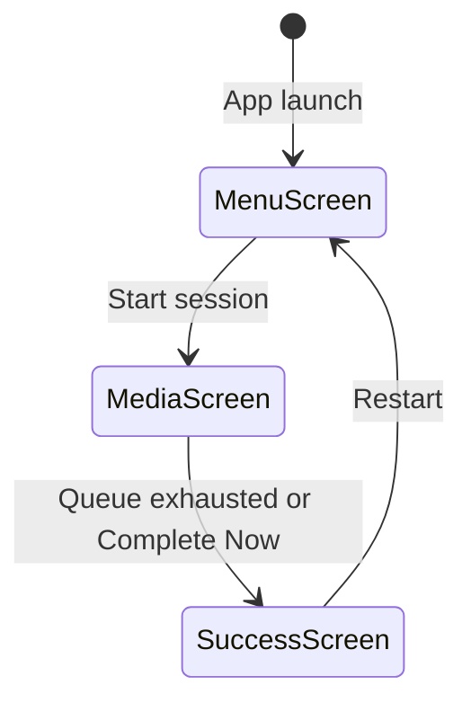

# macOS Design: app-shell

## Context
SwiftUI's `Window` and `WindowGroup` provide managed windows with default title bars. To achieve a fully frameless window with custom chrome, the app uses `NSWindow` customization via `NSApp.windows` manipulation in the `App` delegate, combined with a SwiftUI `ZStack`-based shell.

Key SwiftUI patterns: `@State` for screen visibility, `@EnvironmentObject` for media service injection, `.onAppear` for keyboard event monitoring.

## Goals / Non-Goals
**Goals**: Frameless, rounded, single-window host with three swappable screen panels.  
**Non-Goals**: No multi-window, no menu bar extra, no tray.

## Decisions

### NSWindow customization over pure SwiftUI
SwiftUI's `Window` scene does not expose `titlebarAppearsTransparent` or `styleMask` directly. A small `NSApplicationDelegate` adapter sets `titlebarAppearsTransparent = true`, `titleVisibility = .hidden`, and `styleMask.insert(.fullSizeContentView)` on the window. This gives us a completely frameless canvas while keeping SwiftUI for all content.

### Custom title bar with `.moveWindow` drag gesture
SwiftUI's `.gesture(DragGesture().onChanged { ... })` can move the window by reading `NSWindow.frame`. However, for a professional feel, the title bar `HStack` uses `.onTapGesture` for buttons and a transparent `Color.clear` background with `allowsHitTesting(true)` for the drag zone. Window movement is handled via `NSWindow.performDrag(with:)`.

### `@State private var activeScreen` over NavigationStack
Three `View` instances inside a `ZStack` with `opacity` and `disabled` toggling is simpler than `NavigationStack` (no navigation state serialization, no path management). Screen transitions use `.animation(.easeInOut(duration: 0.25))`.

### Corner radius via `.clipShape(RoundedRectangle(cornerRadius: 30))`
SwiftUI's `clipShape` applies GPU-accelerated clipping natively. Unlike WPF, no `ClipToBounds` workaround is needed -- `clipShape` is reliable on all Apple Silicon and Intel Macs.

## Mermaid: Screen State Machine

## Risks / Trade-offs
- [Risk] `NSWindow.styleMask` manipulation must happen after `WindowGroup` creates the window → Mitigation: use `DispatchQueue.main.async` in `applicationDidFinishLaunching` to ensure window exists.
- [Risk] SwiftUI lifecycle may recreate views on state change, losing keyboard focus → Mitigation: use `.focused()` modifier and `@FocusState` for explicit focus management.

## Migration Plan
N/A -- foundation change.

## Open Questions
*(none)*
