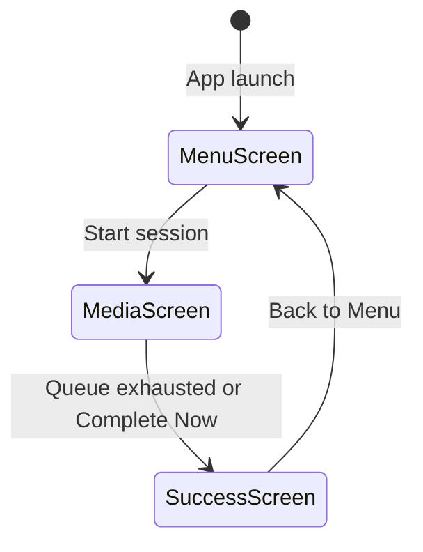

# Windows Design: app-shell

## Context
WPF's default window chrome cannot be styled to be fully frameless while preserving OS hit-testing for drag and resize. `WindowChrome` provides a managed way to keep OS-level window management while removing the visual chrome.

## Goals / Non-Goals
**Goals**: Frameless, rounded, single-window host.  
**Non-Goals**: No tray, no multi-window.

## Decisions

### WindowChrome over custom DragMove
`WindowChrome` exposes a `CaptionHeight` that maps to the OS drag zone — no need to handle `MouseLeftButtonDown` + `DragMove()` manually. This also preserves snap layouts on Windows 11.

### Visibility toggling over Frame/Page navigation
Three Borders in a single Grid is simpler than a WPF `Frame` with page navigation. No navigation stack, no URI routing, no page lifecycle events needed.

### ClipToBounds on outer Border
Without `ClipToBounds=True`, child backgrounds render outside the `CornerRadius` clip region, making corners appear square on some hardware. Clipping fixes this at a negligible GPU cost.

## Mermaid: Screen State Machine

## Risks / Trade-offs
- [Risk] `AllowsTransparency=True` disables hardware acceleration on some GPU configurations → Mitigation: acceptable for this app's use case (no heavy 3D rendering).

## Migration Plan
N/A — foundation change.

## Open Questions
*(none)*
