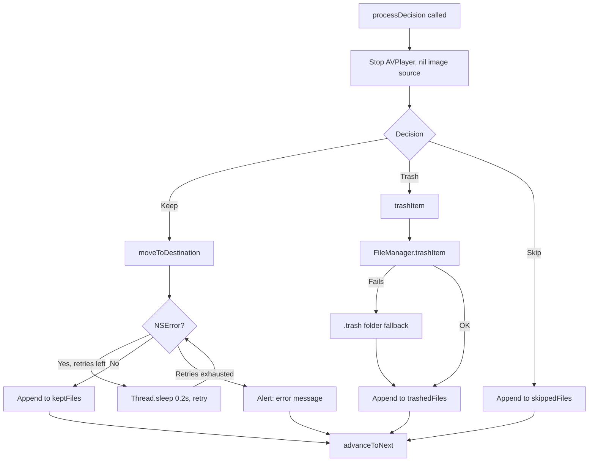

# macOS Design: decision-processing

## Context
`processDecision` is called after the swipe fly-off animation completes (via `withAnimation`'s completion callback, or `onAnimationCompleted` workaround using `DispatchQueue.main.asyncAfter` matching the animation duration). All file I/O runs on the main actor in v1 via `FileManager`.

macOS provides `FileManager.trashItem(at:)` (available since macOS 10.8) for native trash support -- no `Microsoft.VisualBasic` equivalent needed. The API is asynchronous with a completion handler.

## Goals / Non-Goals
**Goals**: Reliable file operations with retry for media lock and clear session accounting.  
**Non-Goals**: No undo, no async I/O in v1, no batch.

## Decisions

### `FileManager.trashItem(at:)` for trash
macOS has a native `trashItem(at:resultingItemURL:)` that moves files to the Trash with undo support. Falls back to manual `.trash` subfolder move if the API throws. This uses the same `.trash` folder convention as the Windows implementation for consistency.

### `Thread.sleep(forTimeInterval: 0.2)` in retry loop
Same pattern as Windows: `Thread.sleep` on the main thread for up to 5 retries × 200ms = max 1s. Acceptable for v1 because the animation has already completed and the user is waiting for the next card anyway.

### UUID prefix for filename collision
`UUID().uuidString.prefix(6)` generates a short unique prefix. Same collision-avoidance strategy as the Windows `GUID` prefix approach.

### Media resource release via explicit `stop()` + `nil` assignment
Before any file operation, the `AVPlayer` is paused, the player item is replaced with `nil`, and the `NSImage` is set to `nil`. This ensures `AVFoundation` and `ImageIO` release their file handles before `FileManager` attempts to move/trash.

## Mermaid: ProcessDecision Flow

## Risks / Trade-offs
- [Risk] Main thread blocking during retry → Mitigation: max 1s; acceptable for v1.
- [Risk] `trashItem(at:)` may present a system dialog on some configurations → Mitigation: the spec explicitly allows host system prompts for trash operations.

## Migration Plan
N/A -- new capability.

## Open Questions
*(none)*
