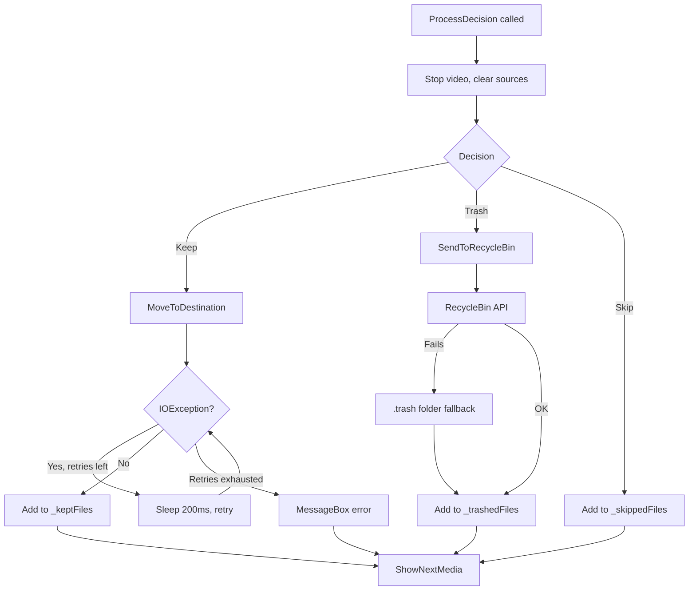

# Windows Design: decision-processing

## Context
`ProcessDecision` is called from the `AnimateOffScreen` `Completed` event handler on the UI thread. All file I/O runs synchronously on the UI thread in v1. `ExecuteWithRetry` uses `Thread.Sleep(200)` to handle media engine lock release (WPF `MediaElement` may hold a file handle briefly after `Stop()` is called).

## Goals / Non-Goals
**Goals**: Reliable file operations with retry for media lock and clear session accounting.  
**Non-Goals**: No undo, no async I/O, no batch.

## Decisions

### Thread.Sleep in ExecuteWithRetry
`Thread.Sleep(200)` on the UI thread is acceptable because the operation is fast (1–5 retries × 200ms = max 1s). A `Task.Run` alternative would require marshalling back to the UI thread for screen updates. Deferred to a future change.

### GUID prefix for filename collision
Avoids silent overwrites without prompting the user on every collision. The prefix is unique per move operation.

### .trash fallback
Ensures files are never permanently deleted silently even if the recycle bin API fails (e.g., network drives, permission issues).

## Mermaid: ProcessDecision Flow

## Risks / Trade-offs
- [Risk] UI thread blocking during retry → Mitigation: max 1s; acceptable for v1.

## Migration Plan
N/A — new capability.

## Open Questions
*(none)*
