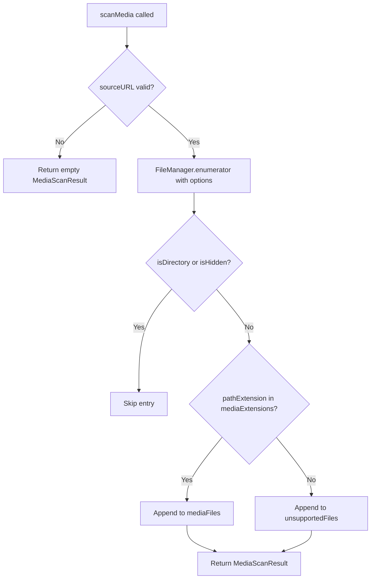

# macOS Design: media-scanning

## Context
`MediaService` is a plain Swift class with no SwiftUI dependencies. It uses `FileManager.default.enumerator(at:includingPropertiesForKeys:)` for recursive scanning, which lazily enumerates directory contents without loading all entries into memory at once. The service is injected into `ContentView` via `@StateObject` and passed down via `.environmentObject()`.

## Goals / Non-Goals
**Goals**: Reliable, testable file discovery with format filtering.  
**Non-Goals**: No file mutation (move/delete), no async operations in v1.

## Decisions

### Protocol + concrete class (`MediaServiceProtocol` / `MediaService`)
Decoupling via protocol allows test doubles (e.g., `MockMediaService`) and makes the scanning contract explicit. Swift's protocol-oriented design makes this idiomatic.

### `FileManager.default.enumerator` over `contentsOfDirectory`
`enumerator(at:)` streams entries lazily instead of allocating a full `[URL]` array upfront. This reduces memory pressure on directories with many files. The `includingPropertiesForKeys: [.isDirectoryKey, .isHiddenKey]` option avoids extra stat calls per file.

### Dot-prefix hidden file exclusion
Checking `url.lastPathComponent.hasPrefix(".")` excludes macOS metadata files (`.DS_Store`, `.localized`), resource forks (`._*`), and Unix-style hidden files. This aligns with the platform-agnostic spec's hidden file requirement.

### Extension filtering via `Set<String>`
A `Set` of lowercase extensions (`jpg`, `jpeg`, `png`, `gif`, `bmp`, `mp4`, `mov`, `wmv`, `avi`) enables O(1) lookup per file. Case-insensitive matching via `pathExtension.lowercased()`.

## Mermaid: Scan Flow

## Risks / Trade-offs
- [Risk] Scanning runs on the calling thread (main actor if called from UI) → Mitigation: acceptable for v1; `FileManager.enumerator` is lazy. Future change can wrap in `Task.detached` with `@MainActor` callback.

## Migration Plan
N/A -- new service.

## Open Questions
*(none)*
