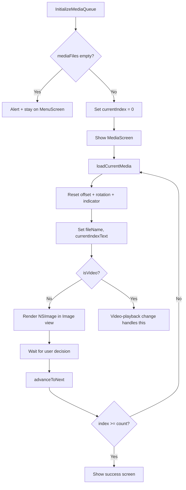

# macOS Design: media-viewer

## Context
The media viewer is a SwiftUI `View` shown inside the app shell's `MediaScreen`. It uses `@State` for queue state (`currentIndex`, `mediaFiles`, `unsupportedFiles`) and `.onAppear` to trigger initialization. Image rendering uses `Image(nsImage:)` for NSImage-backed rendering.

SwiftUI's `Image` view handles layout automatically with `.resizable().aspectRatio(contentMode: .fit)`. No explicit `DecodePixelWidth` is needed -- `NSImage` representations are loaded lazily from disk.

## Goals / Non-Goals
**Goals**: Efficient image rendering, queue management, and direct navigation via editable position counter.  
**Non-Goals**: Video rendering (covered in video-playback), swipe/gesture interaction.

## Decisions

### `NSImage(contentsOf:)` with `NSSize` thumbnail generation
`NSImage(contentsOf:)` loads the image lazily. To constrain memory, the image is resized to a max dimension of 1200px using `NSImageRep` thumbnail generation. This prevents loading a 50MP photo at full resolution into RAM. Apple's ImageIO framework handles the downscaling efficiently at the OS level.

### `@State private var currentIndex` over ObservableObject
Simple value-type state management is sufficient for a single-screen queue. No need for a separate ViewModel class unless the queue grows complex (which it doesn't in v1).

### `TextField` with `onSubmit` for index jump
SwiftUI's `TextField` with `.onSubmit` provides native keyboard handling (Enter to commit). The input is validated: non-numeric or out-of-range values restore the previous display via a local `@State` buffer. After valid jump, `@FocusState` returns focus to the media interaction area.

### Transform state reset via `.animation(.none)`
When a new file loads, `.offset`, `.rotationEffect`, and indicator `.opacity` reset to zero with `.animation(.none, value: currentIndex)` to prevent the reset itself from animating. This is more SwiftUI-idiomatic than directly manipulating CALayer transforms.

## Mermaid: Media Queue and Load Flow

## Risks / Trade-offs
- [Risk] Very large queues (1000+ files) may have sluggish initial population → Mitigation: `FileManager.enumerator` is lazy; only the first image is decoded immediately.
- [Risk] `NSImage(contentsOf:)` may briefly hold a file handle → Mitigation: the image is loaded, resized to thumbnail, and the original `NSImage` is discarded within the same scope; file handle released immediately.

## Migration Plan
N/A -- new capability.

## Open Questions
*(none)*
