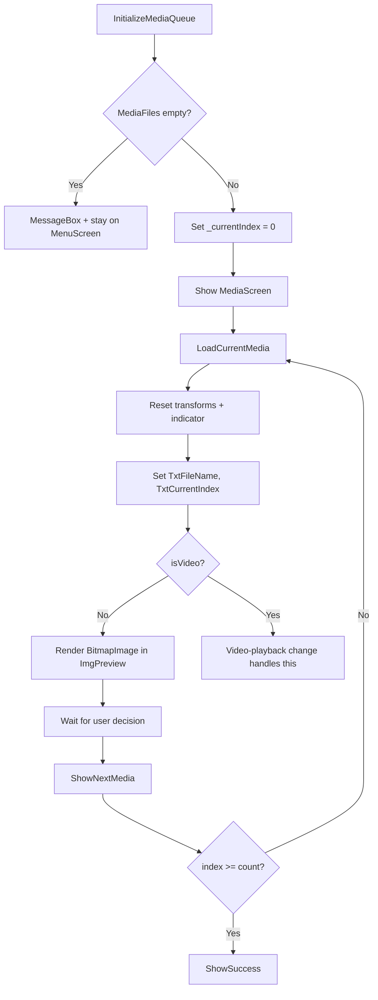

# Windows Design: media-viewer

## Context
The `MediaScreen` grid hosts a `Border` named `MediaContainer` with a `TransformGroup` (`TranslateTransform` + `RotateTransform`) applied for swipe animations. `ImgPreview` and `VidPreview` (added in video-playback) are overlaid inside `MediaContainer` and toggled by `Visibility`.

## Goals / Non-Goals
**Goals**: Efficient image rendering, queue management, and direct navigation.  
**Non-Goals**: Video, swipe/gesture, decisions, summary.

## Decisions

### `DecodePixelWidth = 1000` on BitmapImage
Prevents loading a 20 MP photo at full resolution into RAM. 1000px matches the approximate display width of the media container.

### `CacheOption.OnLoad`
Ensures the file handle is released immediately after decode, preventing the file from being locked when the user later tries to move/delete it.

### `TranslateTransform` + `RotateTransform` on MediaContainer
Attaching the transform group at the container level means both `ImgPreview` and `VidPreview` benefit from swipe animations without duplicating transform logic.

## Mermaid: Media Queue and Load Flow

## Risks / Trade-offs
- [Risk] Very large queues (1000+ files) may have sluggish initialisation → Mitigation: `EnumerateFiles` is lazy; only the first file is decoded immediately.

## Migration Plan
N/A — new capability.

## Open Questions
*(none)*
