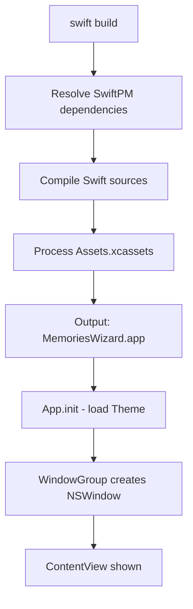

# macOS Design: project-setup

## Context
The macOS implementation uses Swift 5.9+ / SwiftUI on macOS 14 (Sonoma)+. The app is a single-window SwiftUI `App` with `MenuBarExtra`-less design. All platform-specific code lives under `macOS/MemoriesWizard/`.

Global visual styles (colors, fonts, button styles) are applied via a shared `Theme.swift` loaded at app launch, making them available across all views via `@Environment` or direct reference.

macOS apps use `.app` bundle structure with `Info.plist` for metadata. The app icon is set via `Assets.xcassets` and the bundle's `CFBundleIconFile`.

## Goals / Non-Goals
**Goals**: Establish a compilable, runnable SwiftUI project with shared styles loaded.  
**Non-Goals**: No feature logic, no screens beyond a bare window placeholder.

## Decisions

### SwiftUI App lifecycle over AppKit NSApplicationDelegate
`@main App` protocol provides declarative app entry with scene management and resource loading. Chosen over raw `NSApplicationDelegate` because SwiftUI's `WindowGroup` handles window lifecycle, state restoration, and menu integration with less boilerplate.

### Global styles in Theme.swift over inline modifiers
Centralizing colors, fonts, corner radii, and button primitives in one `Theme` struct avoids duplicating style declarations across views. Matches SwiftUI best practices for design token management.

### AppIcon via Assets.xcassets with @2x variants
`Assets.xcassets` with `AppIcon` image set handles all required icon sizes (16x16 through 1024x1024) in one place. Xcode generates the correct `Icon.icns` at build time.

### Crash handler via NSSetUncaughtExceptionHandler + Swift fatalError hook
macOS does not have a single unified "unhandled exception" hook like WPF's `DispatcherUnhandledException`. Two handlers are registered: one for Obj-C exceptions (`NSSetUncaughtExceptionHandler`) and one for Swift runtime errors (signal handler for SIGILL/SIGTRAP/SIGABRT). This covers both Obj-C runtime crashes and Swift `fatalError`/assertion failures.

## Mermaid: Project Bootstrap Flow

## Risks / Trade-offs
- [Risk] Signal-based crash handler may not catch all Swift runtime failures (e.g., async task cancellation) → Mitigation: covers the most common crash types; async error handling is deferred to a future change with `Task` result handling.
- [Risk] Minimum deployment target macOS 14 excludes older Macs → Mitigation: acceptable; SwiftUI maturity and new APIs (e.g., `inspector`, `Table`) justify the floor.

## Migration Plan
No migration needed -- this is the initial project setup.

## Open Questions
*(none)*
