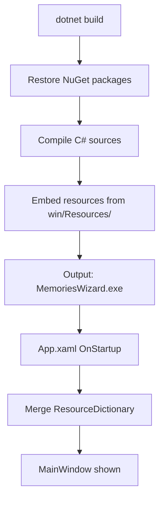

# Windows Design: project-setup

## Context
The Windows implementation uses C# 12 / WPF on .NET 8. The project file (`MemoriesWizard.csproj`) is the single build entry point. All platform-specific code lives under `win/`.

Global visual styles (glass effects, brushes, button styles) are declared in `App.xaml` and loaded at startup so every window can reference them as `StaticResource`.

## Goals / Non-Goals
**Goals**: Establish a compilable, runnable WPF project with shared styles loaded.  
**Non-Goals**: No feature logic, no screens other than the bare window shell.

## Decisions

### SDK choice: `Microsoft.NET.Sdk.WindowsDesktop` with `UseWPF=true`
Chosen over raw MSBuild project because it simplifies NuGet restore and enables `dotnet build` from CLI without Visual Studio.

### Global resource dictionary in `App.xaml`
Centralising all brushes, styles, and effects in one resource dictionary avoids duplicating style declarations per-window and matches WPF idioms.

## Mermaid: Project Bootstrap Flow

## Risks / Trade-offs
- [Risk] `Microsoft.VisualBasic` is a legacy dependency → Mitigation: used only for recycle-bin deletion; can be replaced with P/Invoke `SHFileOperation` if the dependency is removed in future .NET versions.

## Migration Plan
No migration needed — this is the initial project setup.

## Open Questions
*(none)*
