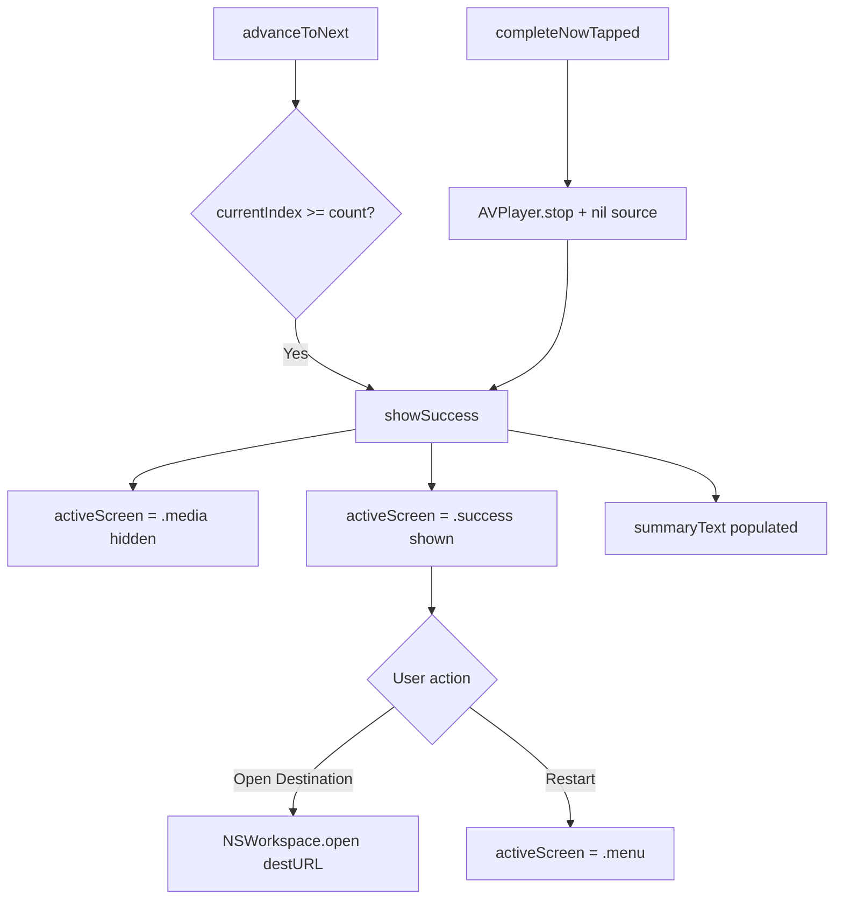

# macOS Design: session-summary

## Context
The success screen is a SwiftUI `View` shown when `activeScreen == .success`. `showSuccess` is called from two paths: `advanceToNext` (queue exhausted) and `completeNowTapped` (early exit). Session count data comes from the `keptFiles`, `skippedFiles`, `trashedFiles`, and `unsupportedFiles` arrays maintained by `decision-processing`.

## Goals / Non-Goals
**Goals**: Clear session feedback and easy access to destination folder.  
**Non-Goals**: No undo, no per-file log, no session persistence.

## Decisions

### `NSWorkspace.shared.open(destURL)` for opening destination
`NSWorkspace.open(_:)` opens a folder in Finder natively. This is the macOS equivalent of `Process.Start("explorer.exe", path)` but more idiomatic -- no process spawning needed, uses Launch Services.

### Paths preserved on Back to Menu
The `Back to Menu` action only toggles `activeScreen` back to `.menu` -- it does not reset `sourcePath` or `destPath`. This allows the user to run another session on the same folders without reconfiguring. `@State` properties retain their values across screen transitions.

### `VStack` with formatted text for summary
SwiftUI's `Text` with string interpolation provides readable formatted output. `Text("Kept: \(keptCount) | Skipped: \(skippedCount) | Trashed: \(trashedCount) | Non-media: \(unsupportedCount)")` renders with automatic wrapping and dynamic type support.

### Complete Now releases media resources
`completeNowTapped` stops the AVPlayer, nils the player item and image source before transitioning to the success screen. This mirrors the spec requirement for releasing active media resources.

## Mermaid: Session Termination Flow

## Risks / Trade-offs
- [Risk] `destPath` may no longer exist if the folder was deleted during sorting → Mitigation: `NSWorkspace.open` will show a Finder error dialog; acceptable for v1.

## Migration Plan
N/A -- new capability.

## Open Questions
*(none)*
