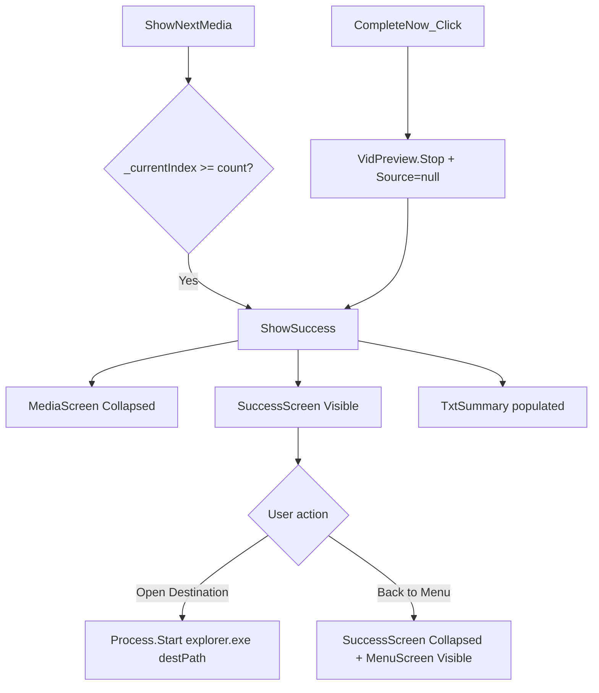

# Windows Design: session-summary

## Context
`SuccessScreen` is the third panel in `MainWindow`'s screen container. `ShowSuccess` is called from two places: `ShowNextMedia` (queue exhausted) and `CompleteNow_Click` (early exit). Session count data comes from the `_keptFiles`, `_skippedFiles`, `_trashedFiles`, `_unsupportedFiles` lists maintained by `decision-processing`.

## Goals / Non-Goals
**Goals**: Clear session feedback and easy access to results.  
**Non-Goals**: No undo, no per-file log, no session persistence.

## Decisions

### Process.Start("explorer.exe", path)
Simple, dependency-free way to open a folder in Windows Explorer. No Shell API needed for this use case.

### Paths preserved on Back to Menu
`BackToMenu_Click` only toggles visibility — it does not reset `_sourcePath` or `_destPath`. This allows the user to run another session on the same folders without reconfiguring.

## Mermaid: Session Termination Flow

## Risks / Trade-offs
- [Risk] `_destPath` may no longer exist if the folder was deleted during sorting → Mitigation: `Process.Start` will fail silently or show an OS error; acceptable for v1.

## Migration Plan
N/A — new capability.

## Open Questions
*(none)*
