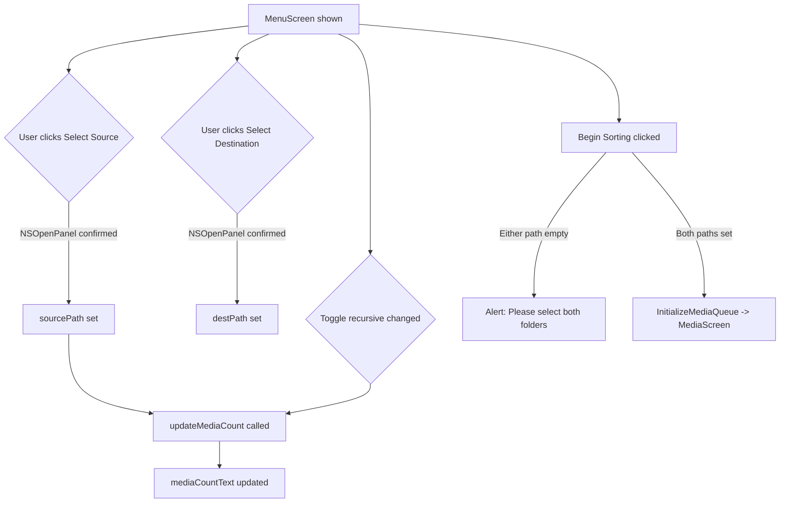

# macOS Design: setup-screen

## Context
The setup screen is a SwiftUI `View` shown when `activeScreen == .menu`. All state (`sourcePath`, `destPath`) is stored as `@State` properties in the main `ContentView` (or dedicated `SetupViewModel` `@StateObject`). The media service is accessed via `@EnvironmentObject` for count preview only -- no files are moved at this stage.

## Goals / Non-Goals
**Goals**: Collect source/dest paths and provide a media count preview before sorting begins.  
**Non-Goals**: No file operations, no media queue initialization details (covered in media-viewer).

## Decisions

### NSOpenPanel via NSViewRepresentable
SwiftUI has no native folder picker. `NSOpenPanel` (AppKit) is wrapped in a helper that presents the dialog modally and returns the selected URL. This gives the standard macOS folder picker experience with sidebar, recent places, and navigation.

### `.onChange(of: sourcePath)` for immediate count refresh
When `sourcePath` changes (after folder selection or recursive toggle), `.onChange` triggers a scan via the media service and updates `mediaCount` `@State`. This is synchronous on the main actor for v1; acceptable for typical media directories (under 1000 files).

### `@AppStorage("recursiveScan")` for toggle persistence
The recursive toggle state survives app restarts using `UserDefaults` via `@AppStorage`. This is a macOS convention -- users expect preference-like settings to persist.

## Mermaid: Setup Screen Flow

## Risks / Trade-offs
- [Risk] Large directories cause main actor block during `updateMediaCount` → Mitigation: acceptable for v1; `FileManager.contentsOfDirectory` is fast on APFS. Can move to `Task.detached` in future change.
- [Risk] Sandbox may block `NSOpenPanel` from accessing arbitrary directories → Mitigation: enable `com.apple.security.files.user-selected.read-write` entitlement. App Store distribution may require additional justification.

## Migration Plan
N/A -- new screen.

## Open Questions
*(none)*
