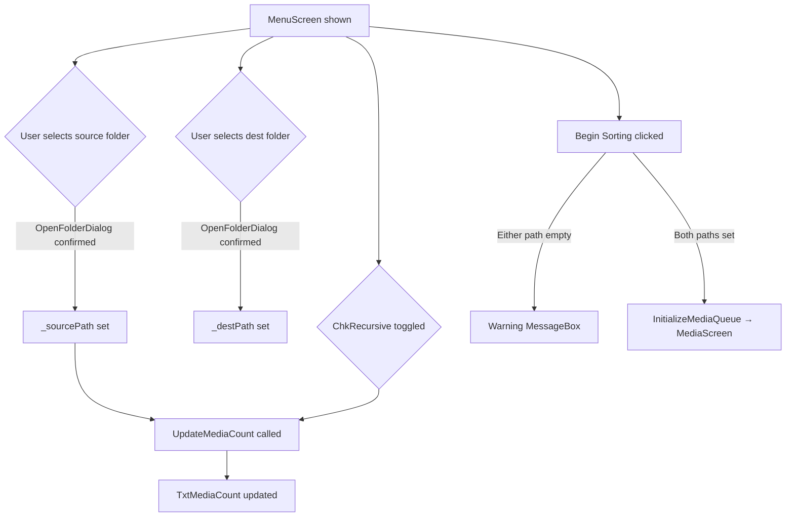

# Windows Design: setup-screen

## Context
The setup screen is the `MenuScreen` panel inside `MainWindow`. All state (`_sourcePath`, `_destPath`) is stored as private fields on `MainWindow`. The `IMediaService` instance is used only to preview the count — no files are moved at this stage.

## Goals / Non-Goals
**Goals**: Collect source/dest paths and provide a media count preview before sorting begins.  
**Non-Goals**: No file operations, no media queue initialisation details (covered in media-viewer).

## Decisions

### OpenFolderDialog (Win32 / WinForms interop)
`Microsoft.Win32.OpenFolderDialog` (available in .NET 8 WPF) is used. This is the native Windows folder picker with no third-party dependency.

### Immediate count update on toggle
`ChkRecursive_Changed` re-scans on every toggle change only if `IsLoaded` is true, preventing a NullReferenceException during XAML initialisation.

## Mermaid: Setup Screen Flow

## Risks / Trade-offs
- [Risk] Large directories cause a UI freeze on `UpdateMediaCount` (runs on UI thread) → Mitigation: acceptable for v1; can move to `Task.Run` in a future change.

## Migration Plan
N/A — new screen.

## Open Questions
*(none)*
