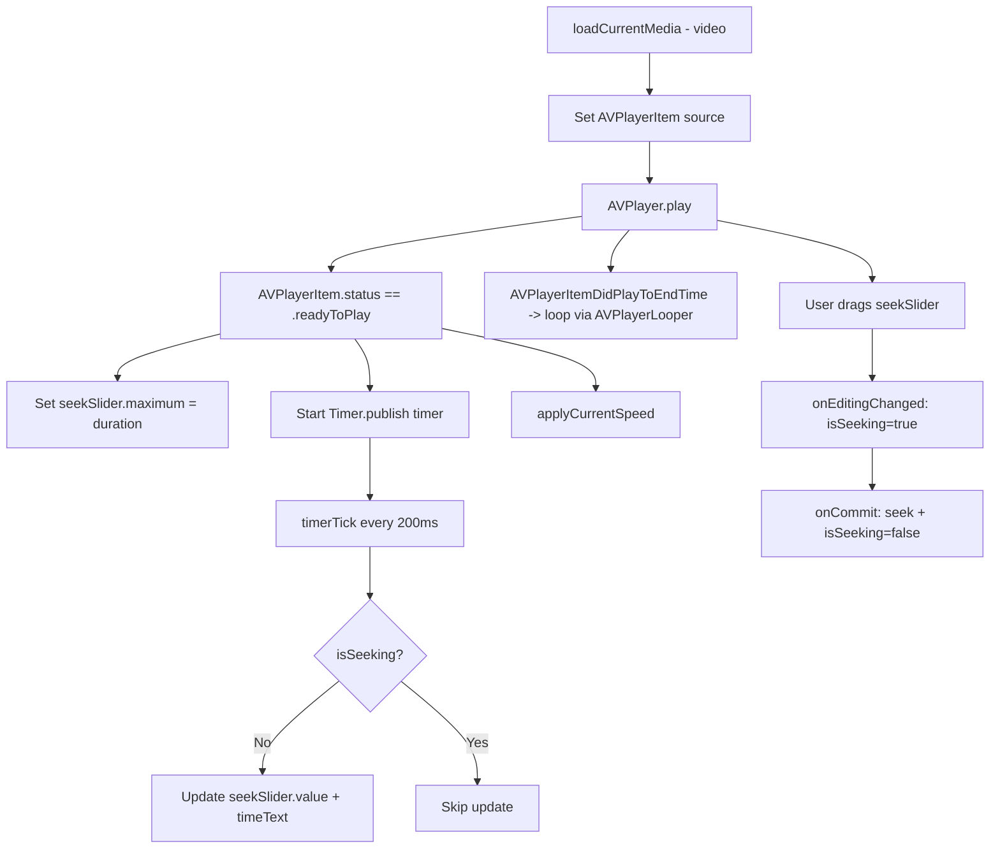

# macOS Design: video-playback

## Context
AVFoundation is the native macOS media framework, far more capable than WPF's `MediaElement`. `AVPlayer` provides frame-accurate seeking, rate control, and looping. The player is wrapped in a SwiftUI view via `VideoPlayerUIView` (an `NSViewRepresentable` of `AVPlayerView`).

SwiftUI has no built-in video player view (unlike iOS 14+ `VideoPlayer`). The `AVPlayerView` from AppKit is wrapped for SwiftUI integration, providing the native playback surface with the standard macOS transport controls hidden (custom overlay used instead).

## Goals / Non-Goals
**Goals**: Inline video playback with seek, volume, speed controls, and auto-loop.  
**Non-Goals**: No full-screen, no audio-only, no external codec.

## Decisions

### `AVPlayer` + `AVPlayerView` over `QTKit` or custom `CALayer` renderer
`AVPlayer` is the modern Apple framework for media playback on macOS (since 10.7). It supports H.264, H.265, ProRes, and most common formats out of the box. `AVPlayerView` provides the native playback surface with hardware-accelerated decoding.

### `AVPlayer.rate` for speed control
`AVPlayer.rate` supports 0.5x to 2.0x natively with pitch-preserving audio. No re-encoding needed. The rate is re-applied on each new video load via `.onAppear` checking the persisted speed selection.

### `AVPlayerLooper` for seamless looping
`AVPlayerLooper(template:player:)` creates a seamless loop without the brief gap that `seek(to: .zero)` produces. Available since macOS 10.12.

### `Timer.publish(every: 0.2)` for seek slider sync
Combine's `Timer.publish` fires every 200ms, updating the seek slider and time display. An `isSeeking` `@State` flag prevents the timer from fighting user drag input -- same pattern as the Windows `_isSeeking` guard.

### `CMTime` for seek with frame accuracy
`AVPlayer.seek(to: CMTime)` provides frame-accurate seeking. WPF's `MediaElement` doesn't support this precision, making macOS seeking superior.

## Mermaid: Video Playback Control Flow

## Risks / Trade-offs
- [Risk] Some codecs (WMV, AVI with non-standard codecs) may fail → Mitigation: `AVPlayerItem.failed` / `error` handler shows alert; user can skip.
- [Risk] `AVPlayerLooper` requires a template `AVPlayerItem` created from an asset → Mitigation: load the asset into an `AVPlayerItem`, create the looper; straightforward initialization pattern.

## Migration Plan
Extends `media-viewer`; no breaking changes to existing image path.

## Open Questions
*(none)*
