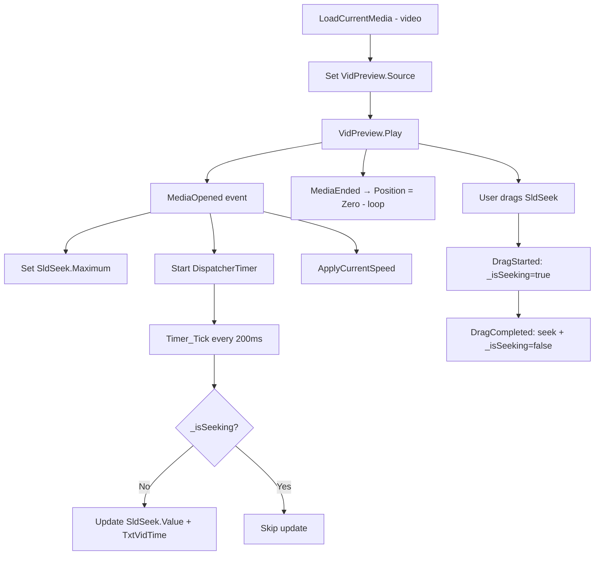

# Windows Design: video-playback

## Context
WPF's `MediaElement` supports `LoadedBehavior="Manual"` which requires explicit `Play()`/`Stop()` calls. `UnloadedBehavior="Stop"` ensures cleanup when the element is removed from the visual tree. `ScrubbingEnabled="True"` allows frame-accurate preview when seeking.

The `_isSeeking` flag prevents a feedback loop: without it, the timer tick would override the slider value while the user drags, causing jitter.

## Goals / Non-Goals
**Goals**: Inline video playback with sufficient controls to evaluate the clip.  
**Non-Goals**: No full-screen, no audio-only, no external codec installation.

## Decisions

### DispatcherTimer at 200ms
Runs on the UI thread; no marshalling needed. 200ms is responsive without excessive CPU for a display-refresh task.

### `MediaElement.LoadedBehavior = Manual`
Required to call `Play()` / `Stop()` programmatically. Auto mode would start playback only when the source changes, which is insufficient here.

### Speed via `SpeedRatio`
WPF `MediaElement.SpeedRatio` natively adjusts playback speed without re-encoding, supporting values from 0.5× to 1.5×.

## Mermaid: Video Playback Control Flow

## Risks / Trade-offs
- [Risk] Some video codecs not supported by WPF `MediaElement` natively → Mitigation: `MediaFailed` handler shows error; user can skip the file.

## Migration Plan
Extends `media-viewer`; no breaking changes to existing image path.

## Open Questions
*(none)*
