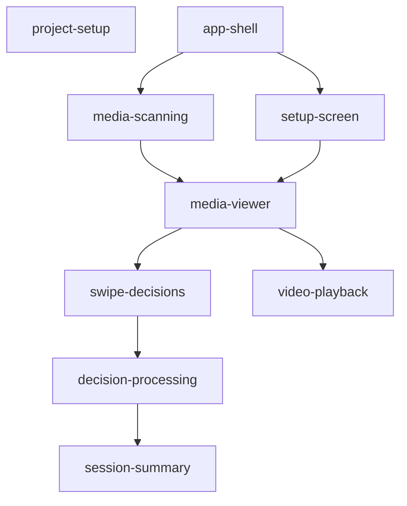

# Change Dependencies

This file tracks the dependency relationships between all OpenSpec changes. Update this file whenever a new change is created or an existing change's dependencies are modified.

## Dependency Graph

## Change Catalogue

| Change | Depends On | Description |
|---|---|---|
| `project-setup` | — | Build foundation: project files, entry point, dependencies, and global styles |
| `app-shell` | — | Frameless window host with three screen panels (Menu, Media, Summary) |
| `setup-screen` | `app-shell` | Folder picker UI with live media count and session start validation |
| `media-scanning` | `app-shell` | Directory scanning service: discovers media files and defines the Decision type |
| `media-viewer` | `setup-screen`, `media-scanning` | Media card queue: image rendering, filename label, position counter, and navigation |
| `swipe-decisions` | `media-viewer` | Drag gesture and keyboard shortcuts that produce a Keep/Skip/Trash decision |
| `decision-processing` | `swipe-decisions` | File operations (move, recycle, skip) with retry logic and session tracking lists |
| `video-playback` | `media-viewer` | Inline video renderer with seek, volume, and playback speed controls |
| `session-summary` | `decision-processing` | End-of-session stats screen with destination shortcut and session reset |

## Implementation Order

Implement changes in this order to satisfy all dependencies:

1. `project-setup` (no dependencies)
2. `app-shell` (no dependencies — can be parallel with `project-setup`)
3. `setup-screen` (requires `app-shell`)
4. `media-scanning` (requires `app-shell` — can be parallel with `setup-screen`)
5. `media-viewer` (requires `setup-screen` + `media-scanning`)
6. `swipe-decisions` (requires `media-viewer` — can be parallel with `video-playback`)
7. `video-playback` (requires `media-viewer` — can be parallel with `swipe-decisions`)
8. `decision-processing` (requires `swipe-decisions`)
9. `session-summary` (requires `decision-processing`)
